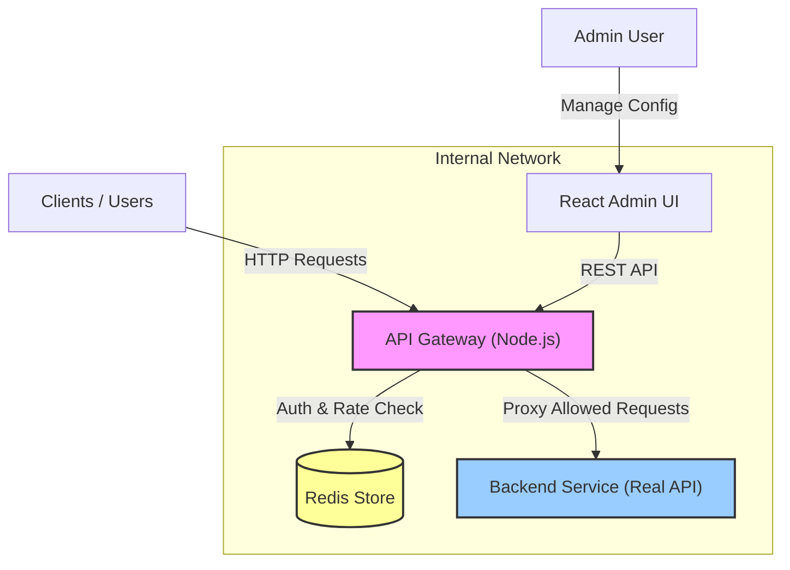
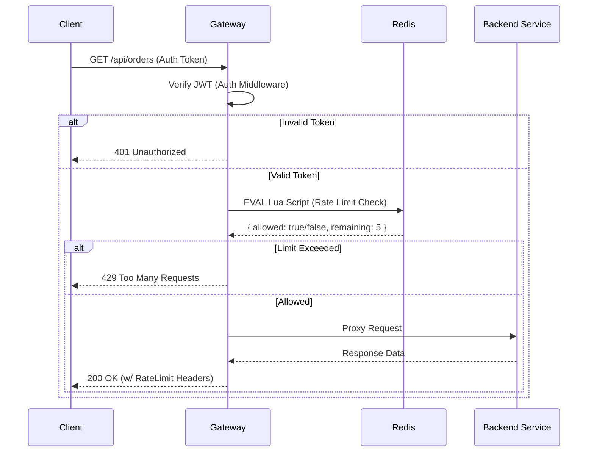
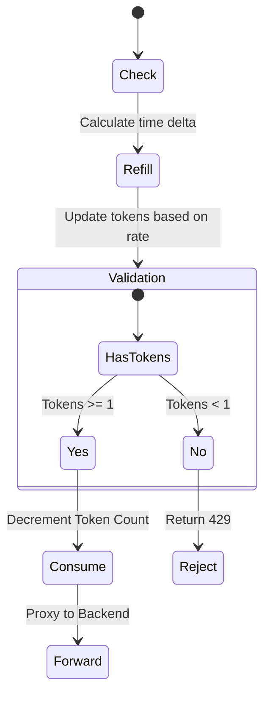

# \uD83D\uDEA6 API Rate Limiting Gateway

A production-grade, distributed API Gateway built with Node.js, implementing **Token Bucket Rate Limiting** using custom Redis Lua scripts for atomicity and high performance.


## \uD83D\uDDFG\uFE0F System Architecture

The system is composed of four main Dockerized services.



### \uD83D\uDCCA Request Flow Lifecycle

Every incoming request goes through a strict pipeline inside the Gateway.



---

## \uD83D\uDCC2 Codebase Map

### Directory Structure
```
api-rate-limiting-gateway/
├── \uD83D\uDCC1 gateway/                  # The Core API Gateway
│   ├── app.js               # Entry point, wires middleware & routes
│   ├── proxy.js             # http-proxy-middleware config
│   ├── redis.js             # Redis client & Atomic Lua scripts
│   ├── middleware/
│   │   ├── auth.js          # JWT Verification
│   │   └── rateLimiter.js   # Token Bucket implementation
│   └── routes/              # Admin & Auth API routes
│
├── \uD83D\uDCC1 backend-service/          # The Real Backend (Downstream)
│   └── server.js            # Express server (Orders/Payments APIs)
│
├── \uD83D\uDCC1 admin-ui/                 # Management Dashboard
│   ├── src/App.tsx          # Main React Dashboard Logic
│   └── Dockerfile           # Multi-stage build (Node -> Nginx)
│
├── docker-compose.yml       # Orchestration for all services
└── Dockerfile               # Consolidated Docker build context
```

---

## \uD83D\uDD27 Core Components

### 1. The Gateway (`/gateway`)
The heart of the system. Designed to scale horizontally with zero shared memory by offloading all rate-limit state to Redis.

- **`redis.js` (The Atomic Brain)**: Contains a custom Lua script loaded into Redis. This script atomically retrieves the current bucket state, refills tokens based on time passed, checks if a token is available, and updates the bucket—all in a single network round-trip used by `EVAL`.
- **`rateLimiter.js`**: Middleware that identifies the user (from JWT) and the route, fetches the specific config (Capacity/RefillRate) from Redis, and executes the Lua script.
- **`proxy.js`**: Relays allowed requests to the `BACKEND_SERVICE_URL`.

### 2. Backend Service (`/backend-service`)
A fully functional REST API mimicking a real-world microservice.
- **Endpoints**:
    - `GET /api/orders`: Returns list of orders (simulates DB read latency).
    - `POST /api/orders`: Creates a new order.
    - `GET /api/payments/:id`: Checks payment status.
- **Latency Simulation**: Intentionally delays responses by 50-300ms to test gateway async performance.

### 3. Admin UI (`/admin-ui`)
A React + Vite SPA for managing the gateway in real-time.
- **Dynamic Config**: Allows setting different rate limits for different API paths (e.g., stricter limits on Payments vs Orders).
- **Features**: Live view of configs, Edit/Add/Delete rules.

---

## \uD83D\uDE80 Setup & Usage

### 1. Start the System
Ensure Docker is running, then launch the stack:
```bash
docker-compose up --build
```
*Wait for all services to report "running"*.

> **Performance**: Tested locally at ~15k req/min with stable latency (<10ms gateway overhead).

### 2. Services Overview
- **Gateway**: `http://localhost:3000`
- **Backend**: `http://localhost:3001` (Direct access - internal)
- **Admin UI**: `http://localhost:8080`
- **Redis**: `localhost:6379`

### 3. Testing Guide

#### Step 1: Get Authentication
You need a JWT to interact with the Gateway.
```bash
# Returns a JSON with "token"
curl -X POST http://localhost:3000/auth/login \
  -H "Content-Type: application/json" \
  -d '{"username":"dev"}'
```

#### Step 2: Make a Request
```bash
# Replace <TOKEN> with the one from Step 1
curl -v http://localhost:3000/api/orders \
  -H "Authorization: Bearer <TOKEN>"
```
Check response headers:
- `X-RateLimit-Limit`: Total capacity.
- `X-RateLimit-Remaining`: Tokens left.

#### Step 3: Configure Limits on Admin UI
1. Go to `http://localhost:8080`.
2. Login with any username.
3. Update specific rules (e.g., `/api/orders` -> Capacity: 5).
4. Run the curl command again to see immediate effects.

---

## \uD83E\uDDE0 Token Bucket Algorithm

The Gateway uses a **Token Bucket** algorithm for rate limiting.



1. **Bucket**: Conceptually holds tokens for a specific User + API Path.
2. **Refill**: Tokens are added mathematically based on `(Time Now - Last Request Time) * Refill Rate`.
3. **Consume**: Each request costs 1 token.
4. **Reject**: If bucket is empty, request is denied.
